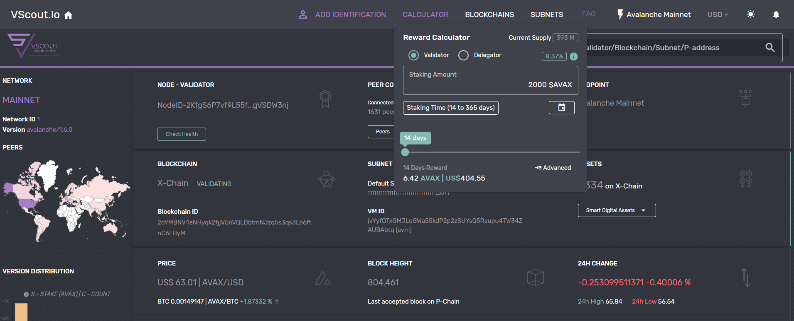

# VScout - Avalanche Validator Explorer

### Project Description:
  VScout is an analytical tool for exploring Avalanche Network subnetworks (dynamic validator pools), and an interface for monitoring individual node metrics.
  Avalanche Validator Explorer is a DApp application for exploring the validator subsets on Avalanche network. It’s written in
  [Quasar](https://quasar.dev/) (Vue, Nodejs, Webpack, Jest), Solidity and includes multiple useful functionalities such as detailed network validators information (including optional identification), network stats, staking calculator, blockchain switcher, configurable endpoints and a FAQ section.
 
 [See](https://vscout.io/)

## Install the dependencies
```bash
npm install
```
### Start the app in development mode (hot-code reloading, error reporting, etc.)
```bash
quasar dev
```

### Lint the files
```bash
npm run lint
```

### Build the app for production
```bash
quasar build
```

### Run jest unit tests
```bash
quasar test --unit jest
```

### Customize the configuration
See [Configuring quasar.conf.js](https://quasar.dev/quasar-cli/quasar-conf-js).
